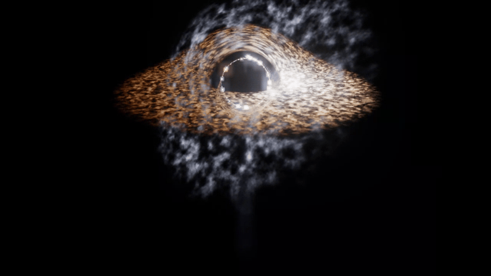
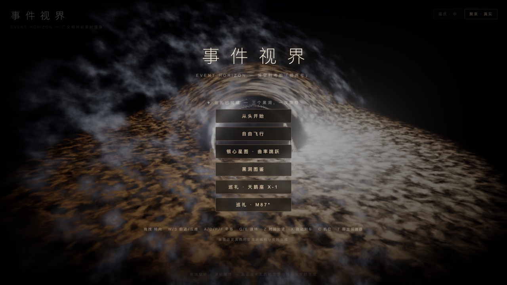
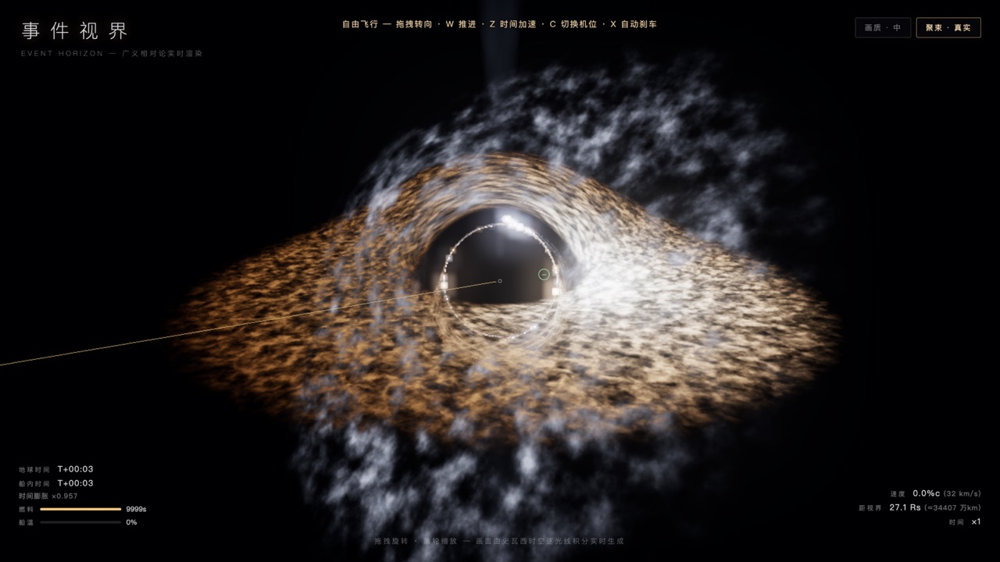
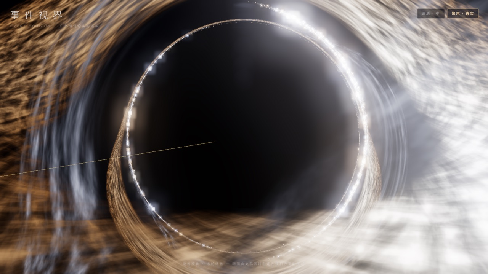
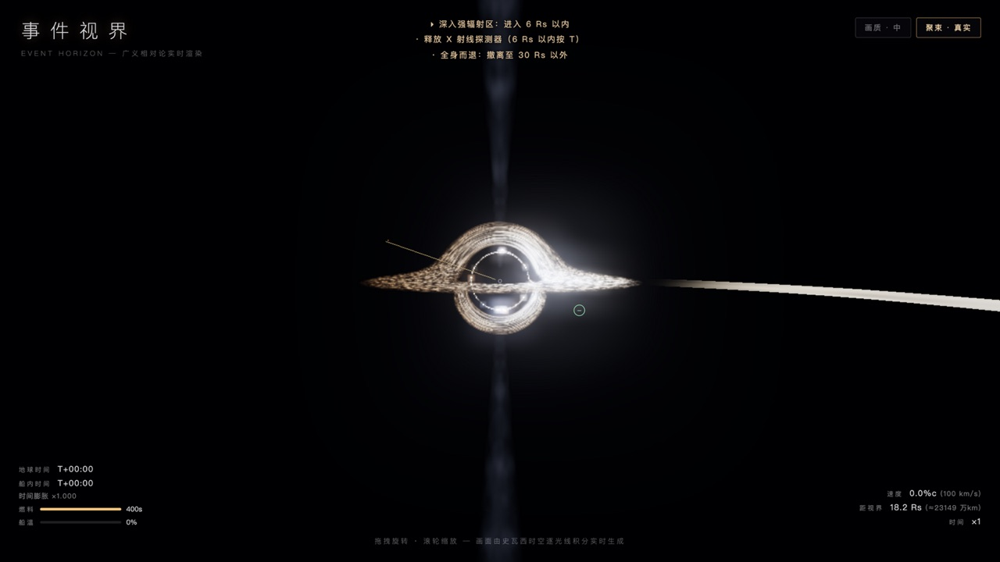
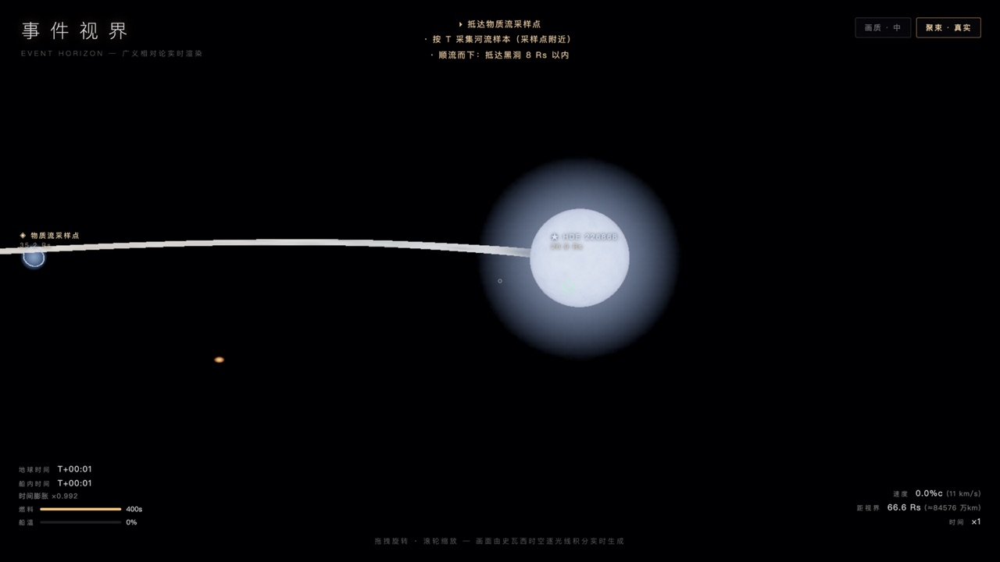
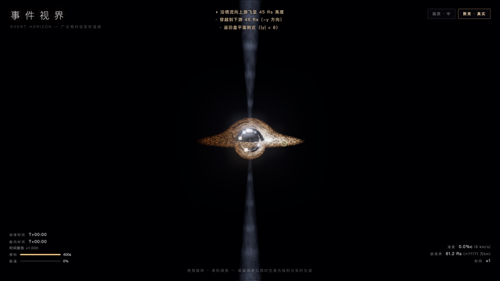
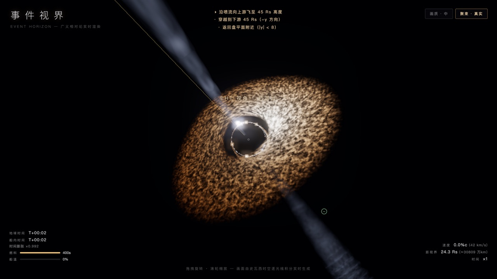
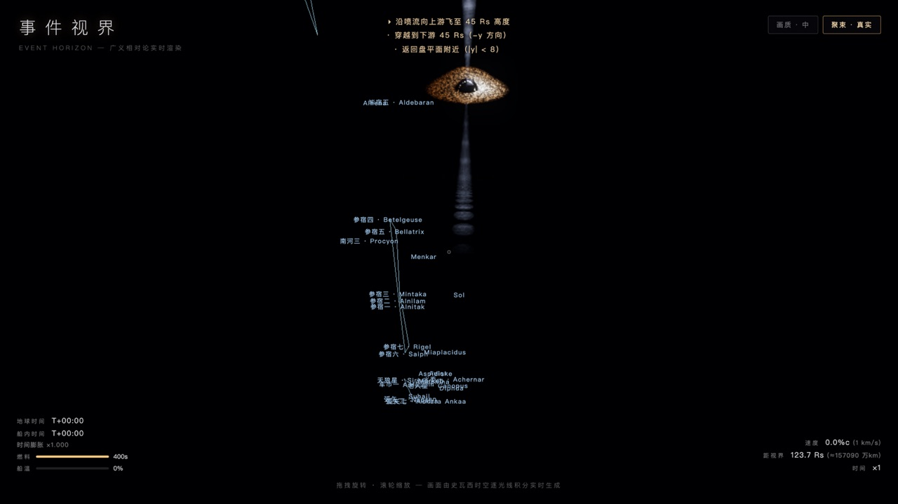
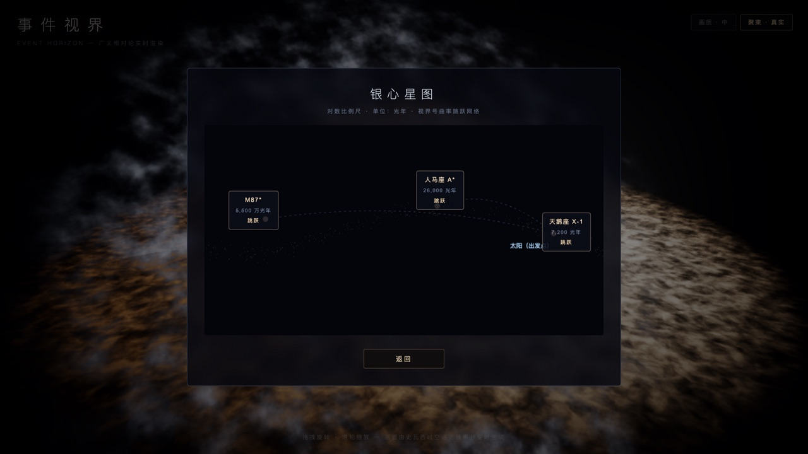

<h1 align="center">事件视界 · EVENT HORIZON</h1>

<p align="center">
  <strong>一台由广义相对论实时驱动的黑洞巡航游戏。</strong><br>
  画面中的每一个光子，都在 GPU 上沿史瓦西时空的零测地线积分生成——
  引力透镜、光子环、吸积盘的多普勒聚束与引力红移，全部是真实物理“算”出来的，不是贴图。
</p>

<p align="center">
  <a href="#-快速开始"></a>
  
  
  
  <a href="./LICENSE"></a>
</p>

<p align="center">
  <br>
  <sub><b>实时渲染录屏</b> · 每一帧都由测地线光线步进现场计算——不是预渲染动画</sub>
</p>

## 为什么值得一玩

大多数“黑洞”游戏用的是美术贴图。《事件视界》的整个天空是一块逐像素光线步进的片元着色器：
每一帧，GPU 为每个像素发射一条光线，在弯曲时空中积分求解，再对照 9.9 万颗真实恒星的星表烘焙天球。
你看到的环、像、亮斑，都是光在这个宇宙里真实会走的路径。

- **🛰️ 14 关战役 + 三站真实黑洞巡礼** — 从远轨适应到 2.6 Rs 的终章抉择；造访人马座 A*、天鹅座 X-1、M87* 三颗真实黑洞
- **🔬 真物理，非贴图** — 零测地线光线步进、Novikov–Thorne 温度轮廓、δ³ 相对论聚束、Paczyński–Wiita 伪牛顿势
- **⏱️ 双时钟时间膨胀** — 地球时间与船内固有时按史瓦西公式分叉，时间加速随距离自动收紧
- **🌌 HYG 星表星空** — 9.9 万颗真实恒星烘焙天球，银河带由恒星密度自然成带，且全部被透镜实时扭曲
- **📷 摄影模式** — 一键隐藏 HUD 拍摄保存 PNG，光子环是天然的大片现场
- **🕹️ 完整玩法** — 燃料/热管理、轨道预测线、探测器释放、双结局、自动存档、黑洞图鉴

## 截图预览

<table>
  <tr>
    <td align="center" width="33%">
      <br>
      <sub><b>主菜单</b> · 环绕人马座 A* 的电影镜头巡航</sub>
    </td>
    <td align="center" width="33%">
      <br>
      <sub><b>引力透镜</b> · 吸积盘的远侧被弯折到阴影上方与下方</sub>
    </td>
    <td align="center" width="33%">
      <br>
      <sub><b>光子环</b> · 贴近 3.5 Rs：绕黑洞一圈后才抵达你眼中的光</sub>
    </td>
  </tr>
  <tr>
    <td align="center">
      <br>
      <sub><b>天鹅座 X-1</b> · 热吸积盘、喷流与物质流同框</sub>
    </td>
    <td align="center">
      <br>
      <sub><b>洛希瓣之河</b> · 蓝超巨星 HDE 226868 被撕出的物质之桥</sub>
    </td>
    <td align="center">
      <br>
      <sub><b>M87*</b> · 双极喷流携行进结节，延伸 70 Rs</sub>
    </td>
  </tr>
  <tr>
    <td align="center">
      <br>
      <sub><b>M87* 正脸</b> · 俯视光子环「甜甜圈」，多普勒聚束增亮一侧</sub>
    </td>
    <td align="center">
      <br>
      <sub><b>星图模式</b> · HYG 真实星表，星座连线 + 中文星名</sub>
    </td>
    <td align="center">
      <br>
      <sub><b>银心星图</b> · 曲率跳跃网络，三站真实黑洞巡礼</sub>
    </td>
  </tr>
</table>

## 🚀 快速开始

需要 **Node.js 18+** 和一款支持 **WebGL2** 的浏览器（Chrome / Edge / Safari 均可）。

```bash
git clone https://github.com/pzy2000/The-Black-Hole.git
cd The-Black-Hole
npm install
npm run dev        # 开发服务器 → http://localhost:5188
```

```bash
npm run build      # 生产构建（tsc 类型检查 + vite 打包，输出到 dist/）
npm run preview    # 本地预览构建产物
```

> macOS 用户也可以双击 `启动事件视界.command`——首次自动构建，之后直接打开浏览器即玩。

## 🎮 操作

| 按键 | 功能 |
|---|---|
| 鼠标拖拽 | 转向 |
| W / S | 主引擎前进 / 反推 |
| A / D / R / F | 左右平移 / 升降 |
| Q / E | 滚转 |
| Z | 时间加速 ×1–×1000（随距离自动收紧） |
| X | 自动刹车 |
| C | 机位（追尾 / 座舱 / 自由 / 朝向黑洞） |
| T | 释放探测器 / 采样 / 对接 |
| P | 摄影模式（HUD 隐藏 + 拍摄保存 PNG） |
| H | 显隐 HUD |
| M | 星图模式（星座连线 + 亮星名） |
| E | EHT 视角（M87* 站，地球观测几何） |

右上角开关：画质三档 · 多普勒聚束「真实 ↔ 电影」。

## 🌌 游戏内容

**第一篇章 · 八关战役（人马座 A*）**

1. **远轨适应** — 学会推进、时间加速与安全减速
2. **光子环摄影** — 深入 3.5 Rs 拍下黑洞剪影
3. **盘缘采样** — 热管理学：贴盘辐射 vs 主动冷却
4. **引力救援** — 拦截一艘正坠向视界的失控货船
5. **深入 ISCO** — 越过最内稳定轨道投放探测器
6. **红移测绘** — 三个深度校准时钟，验证引力时间膨胀
7. **高温区** — 盘内缘采样，热量暴涨下的极限操作
8. **终章 · 视界线** — 在 2.6 Rs 做出选择：结局 A「折返的人」或结局 B「坠入永恒」

**第二篇章 · 真实宇宙巡礼**

- **天鹅座 X-1** — 人类确认的第一个黑洞 + 蓝超巨星 HDE 226868（临边昏暗 / 星风辐照）+ 洛希瓣物质流
- **M87*** — 65 亿 M☉，进动喷流带行进结节；EHT 视角复现 2019 年黑洞照片的观测几何
- **银心星图** — 三站之间曲率跳跃（星流隧道动画）；「黑洞图鉴」收录三站真实档案

进度自动存档（localStorage），主菜单可继续。完整设计文档见 [PLAN.md](./PLAN.md)。

## 🔬 已实现的物理

- **零测地线光线步进**（d²x/dλ² = −1.5·h²·x/r⁵）：阴影、引力透镜、光子环、盘的上下像
- **吸积盘**：Novikov–Thorne 温度轮廓、开普勒差速旋转湍流、双相位流动避免噪声剪切
- **相对论多普勒 + 引力红移**：δ³ 聚束、颜色沿黑体谱偏移（EHT M87* 同款效应）
- **相对论喷流**：β=0.9 锥形外流、多普勒增亮、湍流结节
- **潮汐撕裂事件（TDE）**：倾斜平面的蓝白碎屑流
- **飞船轨道**：Paczyński–Wiita 伪牛顿势（保留真实 ISCO 行为），时间膨胀按史瓦西公式精确计算
- **程序星空**：黑体色温恒星 + 银河带，全部被透镜实时扭曲

## 📁 项目结构

```
src/
├── main.ts          # 主循环、相机、键控、EHT/星图/摄影模式
├── shaders.ts       # 黑洞片元着色器：测地线积分、盘、喷流、天空采样
├── sky.ts           # HYG 星表 → 天球纹理烘焙
├── constellations.ts# 星座连线定义
├── systems.ts       # 三个黑洞系统的物理参数（质量/盘/伴星/喷流）
├── missions.ts      # 14 关任务：目标、简报、事件脚本
├── ship.ts          # 飞船模型与视觉
├── hud.ts / ui.ts   # 飞行 HUD / 菜单、星图、图鉴
├── input.ts         # 键鼠输入
├── state.ts         # 游戏状态与物理常量（GM、时间膨胀、引力）
└── style.css
scripts/
└── build-sky.mjs    # 星表预处理（assets/hyg.csv → public/sky）
```

## 🤝 参与贡献

Issue 与 PR 均欢迎！顺手可做的事：新的黑洞系统、Kerr 克尔黑洞旋转时空、更精确的辐射转移、
手柄支持、更多语言。动手前可以先跑 `npm run dev` 确认现状，提交请保持 `npm run build` 通过。

## 📄 许可证

[MIT](./LICENSE) © 2026 · 玩得开心，也请对真实宇宙保持敬畏。

## 🙏 致谢

- [HYG Database](https://github.com/astronexus/HYG-Database)（David Nash）— 12 万颗恒星星表
- [three.js](https://threejs.org/) 与 [Vite](https://vitejs.dev/)
- Event Horizon Telescope Collaboration — 2019 年的 M87* 照片给了这个项目一个终点站
- 《星际穿越》与 Kip Thorne 的《The Science of Interstellar》— 所有黑洞渲染者的启蒙
